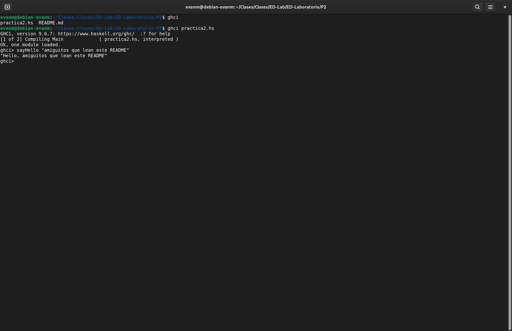

# Práctica 2

## Objetivo
Está práctica tuvo como objetivo; aprender y aplicar las herramientas de GHC y Haskell para crear funciones con distintas funcionalidades. Aprender a manejar los tipos de dato, condicionales y funciones integradas de haskell.

---

## Prompt

La imagen del *prompt* cargando la función `sayHello`.

## Tiempo Requerido
Para realizar esta práctica me tarde varios dias en los que dividi las tareas. Realizar las funciones, hacer los comentarios de las funciones y realizar la función extra.

Me tarde juntando todos los módulos alrededor de *2 horas* para terminar la práctica. 