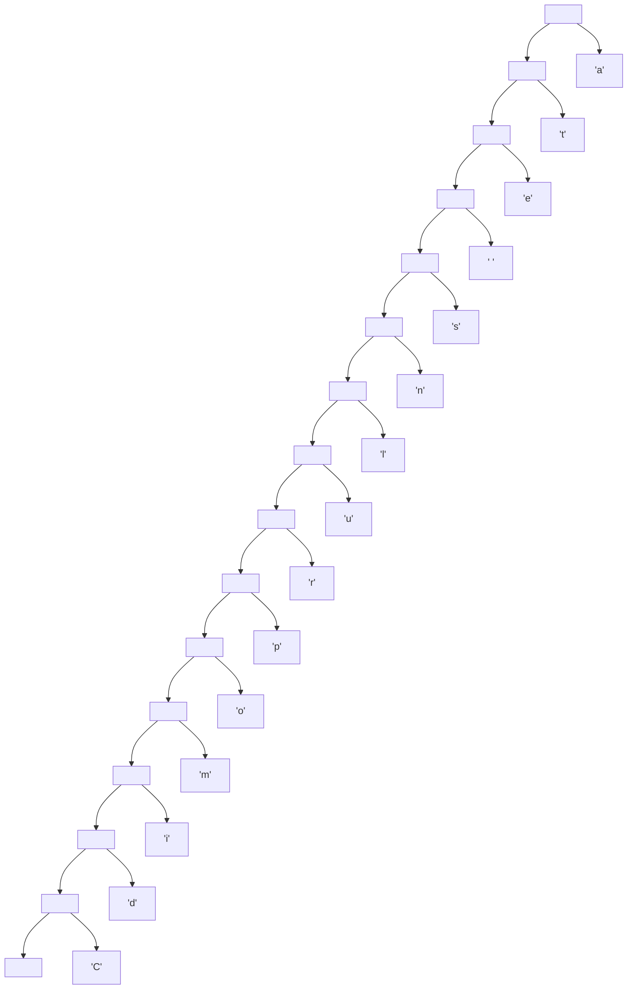

# Codificación de Huffman

## Objetivo

Realizar la implementación de compresión de archivos de Huffman.

Codificar y decodificar archivos de texto a partir de árboles de Huffman.

## Funcionamiento

El programa analiza la frecuencia de aparición de cada carácter en una cadena de texto, construye un árbol de Huffman y genera una codificación binaria única para cada símbolo.
Posteriormente, es posible revertir el proceso (decodificación) utilizando el árbol original.

## Ejecución

Lo primero que se debe hacer para cifrar o descifrar una cadena de texto con este programa es abir el intérprete de Haskell.
En este caso podemos usar **GHCI** en la carpeta raíz del proyecto.

``` bash
ghci Proyecto.hs
```

Debe de aparecer lo siguiente para comprobar una correcta compilación.

``` bash
GHCi, version 9.6.7: https://www.haskell.org/ghc/  :? for help
[1 of 3] Compiling Aux              ( Aux.hs, interpreted )
[2 of 3] Compiling Main             ( Proyecto.hs, interpreted )
Ok, two modules loaded.
ghci> 
```

### Cifrar

Para cifrar una cadena de texto se debe realizar lo siguiente:

1. Definimos la frase que queremos cifrar.

``` bash
ghci> p = "Cantata de puentes amarillos"
```

2. Usamos la función **usarCifrado** para obtener la cadena comprimida de nuestro mensaje.

```bash
ghci> c = usarCifrado p
ghci> c
"0000000000000011000001011011000100000000000001001000100000000010000000100100000101001000010001100000000000110000000010000000000001000000100000010000000000100001"
```

### Descifrar

Para descifrar una cadena de texto vamos a necesitar la cadena binaria y el árbol asociado a la cadena sin cifrado. Para este ejemplo vamos a usar la frase que ya definimos y creando su árbol correspondiente.

1. Creamos el árbol original.

```bash
ghci> a = creaArbol p
ghci> a
Nodo (Nodo (Nodo (Nodo (Nodo (Nodo (Nodo (Nodo (Nodo (Nodo (Nodo (Nodo (Nodo (Nodo (Nodo Vacio (Hoja 'C')) (Hoja 'd')) (Hoja 'i')) (Hoja 'm')) (Hoja 'o')) (Hoja 'p')) (Hoja 'r')) (Hoja 'u')) (Hoja 'l')) (Hoja 'n')) (Hoja 's')) (Hoja ' ')) (Hoja 'e')) (Hoja 't')) (Hoja 'a')
```

Podemos observar su visualización con Mermaid de la siguiente manera:



2. Ahora para decodificar la cadena binaria. Hacemos lo siguiente:

```bash
ghci> descifrar c a
"Cantata de puentes amarillos"
```

Y tenemos el mensaje descifrado de nuevo.

## Tiempo Requerido

- Frecuencias de carácteres: 25 minutos
- Crear árbol de Huffman: 30 minutos.
- Codificar: 45 minutos.
- Decodificar: 30 minutos
- README : 60 minutos

## Comentarios Extra

Podriamos realizar el vaciado de datos binarios a un archivo para ver en funcionamiento la compresión del espacio.
